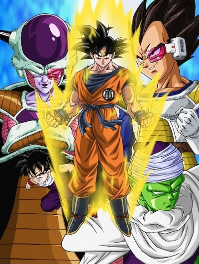
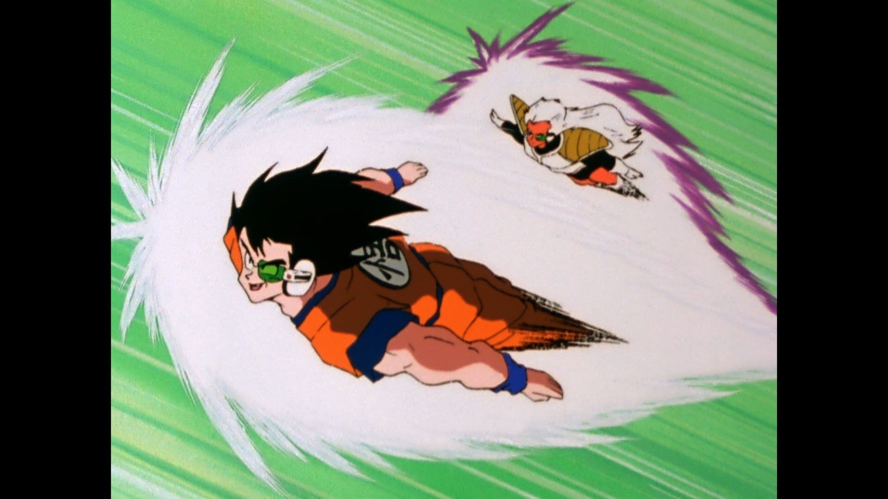
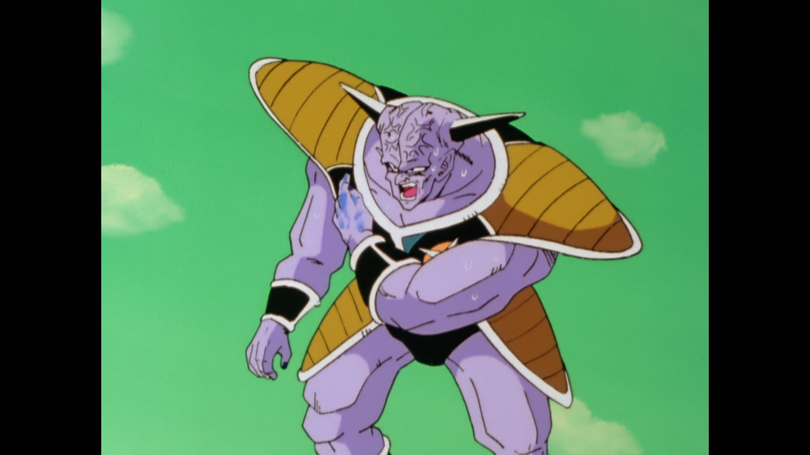
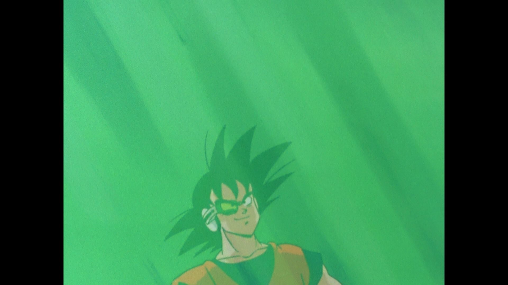
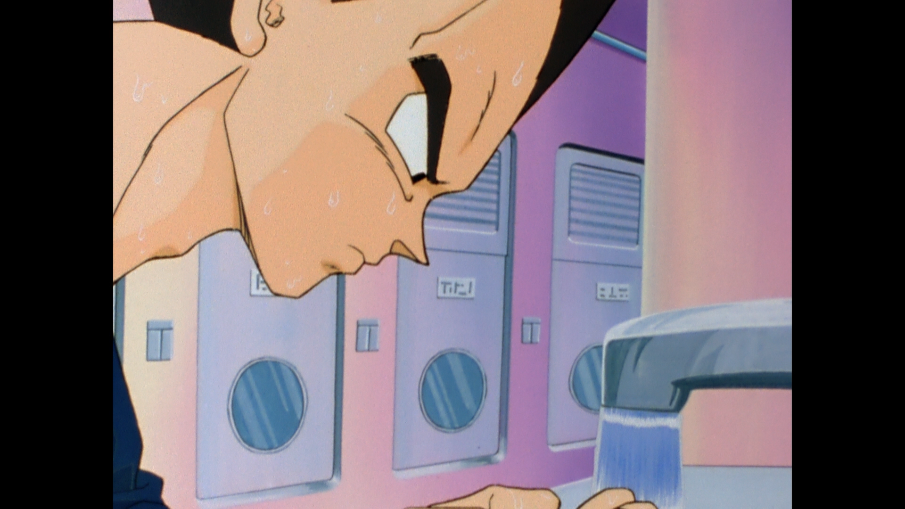
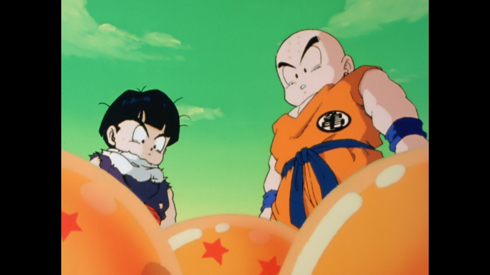
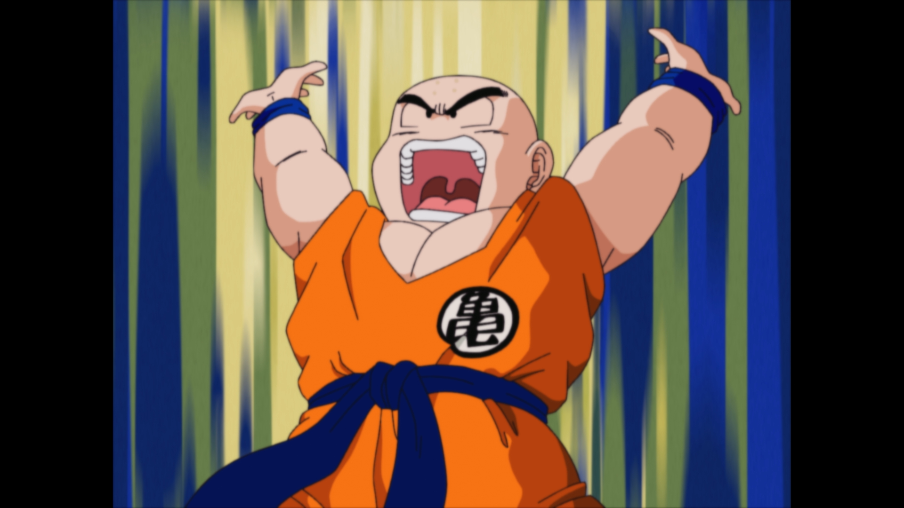
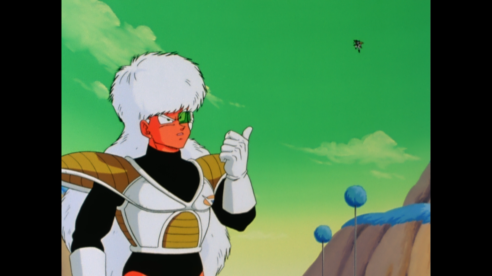
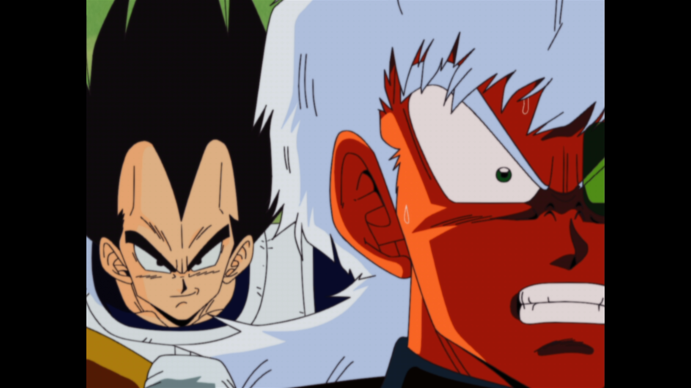

# [Dragon Ball Kai][anidb_url]

[anidb_url]: https://anidb.net/anime/6399

## Basic info

**Name**: Dragon Ball Kai, Dragon Ball Z Kai 
**Type**: TV Series, 97 episodes 
**Year**: 2009 

## Screenshots

| | | | |
| - | - | - | - |
|  |  |  |  |
| | | | |
|  |  |  |  |
| | | | |

## Common problems

* 16mm film footage out of focus (presumably because QTEC didn't calibrate the scanner to 16mm). Only 35mm film footage is in focus.
* Digital redraws with aliasing, which were blurred ([6](screenshots/screenshot06.png) and [8](screenshots/screenshot08.png)).
* Grid-like pattern appears randomly in every episode with no apparent reason on both film and digital ([8](screenshots/screenshot08.png)).

## Additional notes

[Issue](https://github.com/LightArrowsEXE/QTEC/issues/6)

* 35mm film footage ranges from halfway through episode 34 to episode 38.
